# Autonomous Cyber Battle Hackathon

This README explains the whole project for someone with zero background.
If you can use a web browser and run a few Docker commands, you can operate this platform.

## Table of contents

- [1. What this project is](#1-what-this-project-is)
- [2. Big picture (simple view)](#2-big-picture-simple-view)
- [2.1 Visual diagrams](#21-visual-diagrams)
- [3. Folder layout and what each part does](#3-folder-layout-and-what-each-part-does)
- [4. Ports and URLs](#4-ports-and-urls)
- [5. Prerequisites (what you must install)](#5-prerequisites-what-you-must-install)
- [6. How to start the platform (step by step)](#6-how-to-start-the-platform-step-by-step)
- [7. How to stop and clean up](#7-how-to-stop-and-clean-up)
- [8. How a battle works](#8-how-a-battle-works)
- [9. Main APIs explained simply](#9-main-apis-explained-simply)
- [10. How participants should use this](#10-how-participants-should-use-this)
- [11. Security and fair-play boundaries](#11-security-and-fair-play-boundaries)
- [12. Common operations for organizers](#12-common-operations-for-organizers)
- [13. Troubleshooting (beginner friendly)](#13-troubleshooting-beginner-friendly)
- [14. Config values you can tune](#14-config-values-you-can-tune)
- [15. Where to read next](#15-where-to-read-next)
- [16. Quick start for a complete first run](#16-quick-start-for-a-complete-first-run)

---

## 1. What this project is

This project is a **complete local cyber battle platform**.
It simulates a hackathon where multiple teams write bots that:

- attack other teams,
- defend their own services,
- and gain points in a timed competition.

The platform includes:

- 10 team environments,
- a central game controller (orchestrator),
- an admin panel,
- a live public scoreboard,
- and a browser IDE for each team.

---

## 2. Big picture (simple view)

Think of the system as 3 layers:

1. Team layer (10 copies):
   - vulnerable services (`web`, `api`, `file`, `db`)
   - one nginx proxy per team
   - one IDE per team to write and run attacker/defender bots

2. Control layer:
   - orchestrator decides active service, computes score, stores events

3. UI layer:
   - admin dashboard to start/stop battle and manage teams
   - tournament display for audience/live ranking view

---

## 2.1 Visual diagrams

### Diagram A: Full system architecture

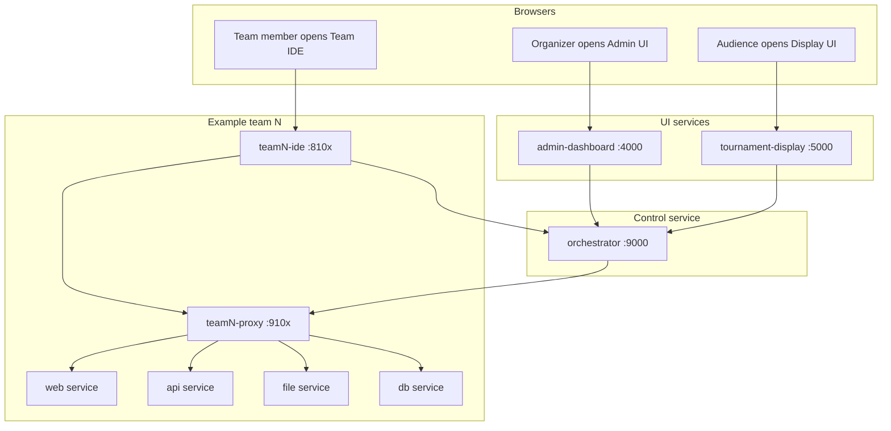

### Diagram B: Team internal traffic path

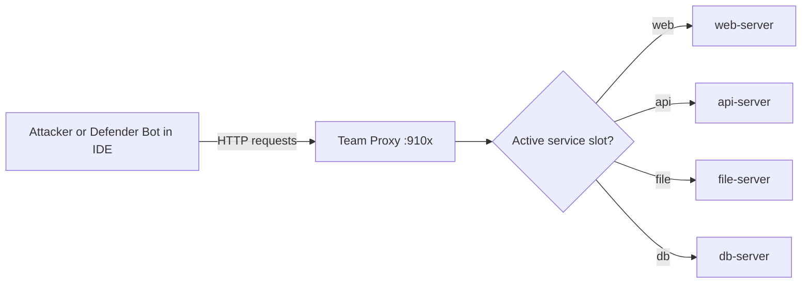

### Diagram C: Battle lifecycle state machine

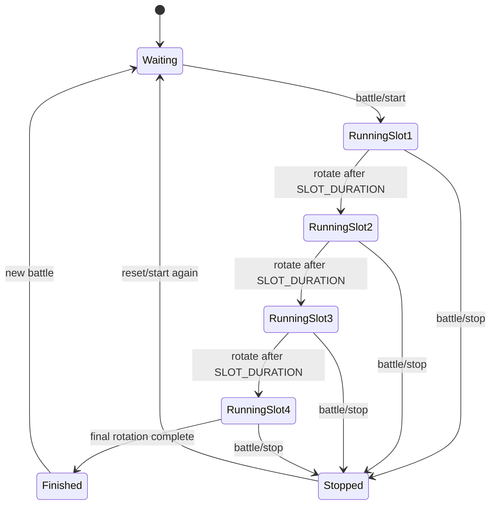

### Diagram D: Score calculation flow

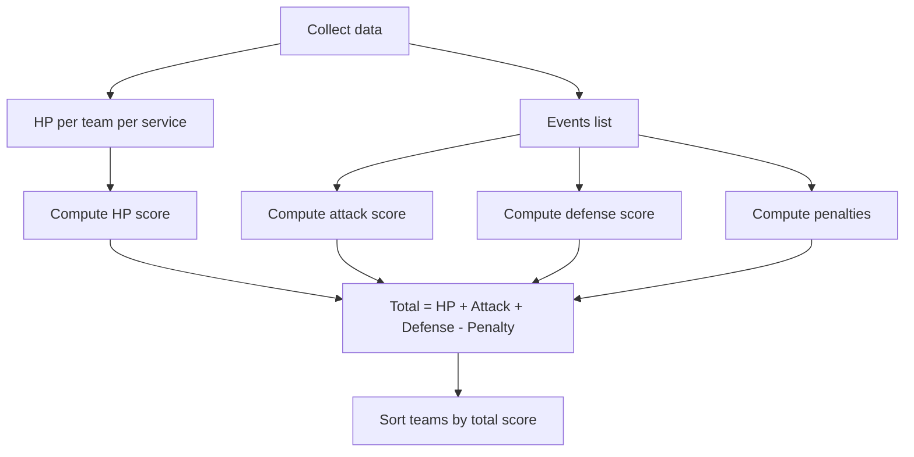

### Diagram E: Network and ports map

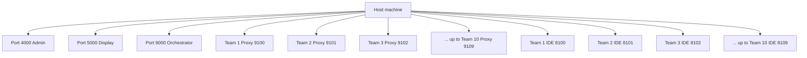

### Diagram F: One full request journey (sequence)

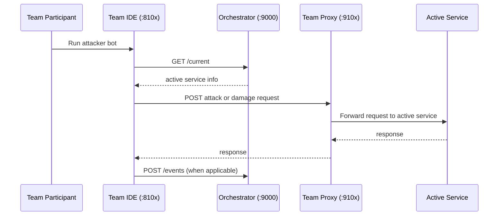

### Diagram G: Docker networks (battle-net vs management-net)

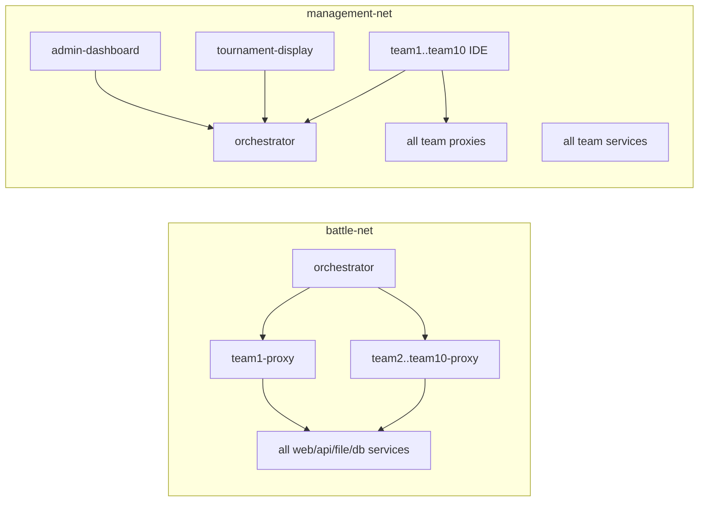

### Diagram H: Admin button to game effect flow

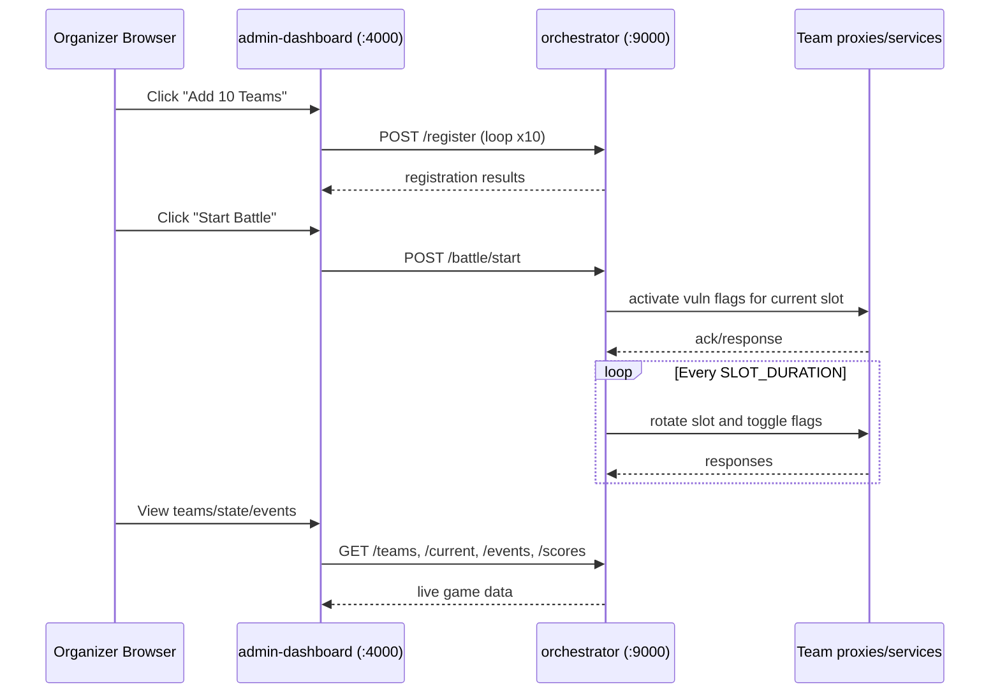

How to read these diagrams quickly:

- A shows all major pieces and how they connect.
- B shows what one team bot request touches.
- C shows battle timing and state transitions.
- D shows where score numbers come from.
- E shows which port opens which service.
- F shows one end-to-end request path.
- G shows why two Docker networks are used.
- H shows what admin actions do behind the scenes.

---

## 2.2 Real interface screenshots

These are real captures from the running platform web interfaces.

### Team IDE (live)

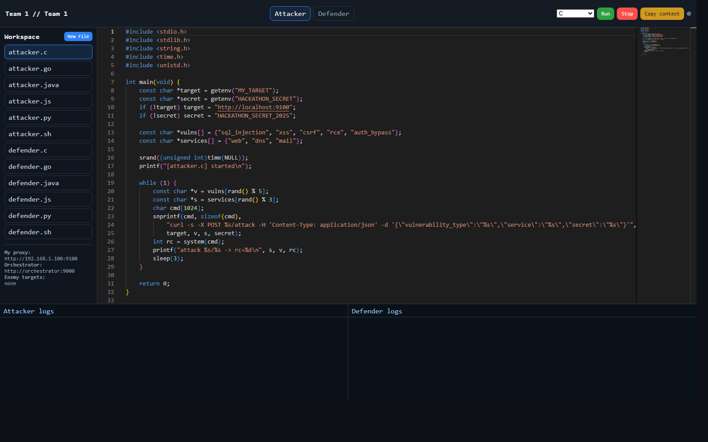

### Admin dashboard (add file to show here)

When you add this file, GitHub will render it in this section:

`docs/screenshots/admin-dashboard.png`

```markdown
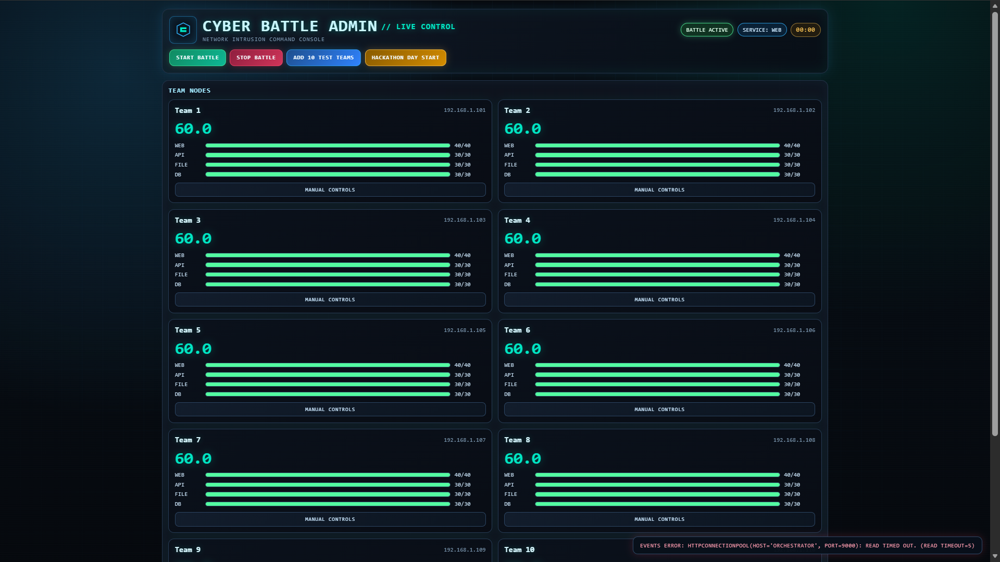
```

### Tournament display (add file to show here)

When you add this file, GitHub will render it in this section:

`docs/screenshots/tournament-display.png`

```markdown
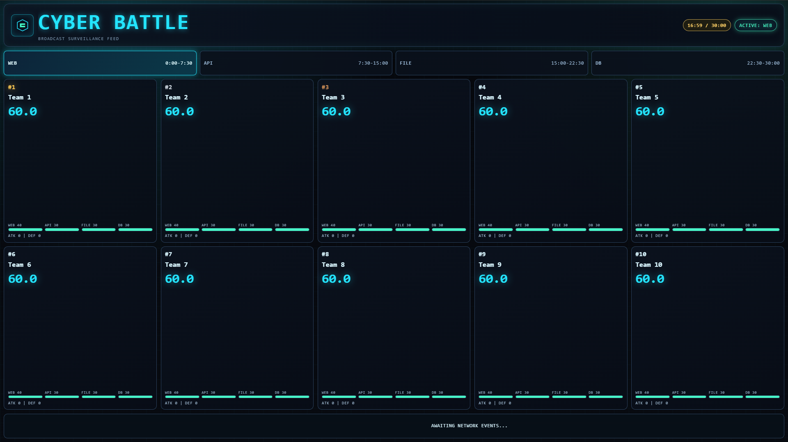
```

---

## 3. Folder layout and what each part does

Project root:

- `PARTICIPANT_RULEBOOK.txt`
  - Rules and participant instructions.

- `README.md`
  - This file.

- `organizer-stack/`
  - All organizer-side services and compose file.

- `team-stack/`
  - Reusable images/templates used to build each team service.

### 3.1 `organizer-stack/`

- `docker-compose.yml`
  - Main runtime definition for the whole platform.
  - Launches all 10 teams + orchestrator + admin + display.
  - Defines ports, networks, volumes, and environment variables.

- `admin-dashboard/`
  - Admin web app (Flask).
  - `app.py`:
    - API bridge to orchestrator.
    - Team management endpoints.
    - Battle start/stop endpoints.
    - bulk add teams + hackathon day start endpoint.
  - `templates/index.html`:
    - Admin UI page.
  - `Dockerfile`, `requirements.txt`:
    - Build and dependencies for admin service.

- `orchestrator/`
  - Main game engine (Flask + APScheduler).
  - `orchestrator.py`:
    - Team registration.
    - Battle state machine.
    - Service-slot rotation.
    - Event handling.
    - score calculation.
    - SSE stream for live updates.
  - `Dockerfile`, `requirements.txt`:
    - Build and dependencies.

- `tournament-display/`
  - Public read-only tournament view.
  - `app.py`:
    - pulls data from orchestrator.
  - `templates/display.html`:
    - live scoreboard UI.
  - `Dockerfile`, `requirements.txt`:
    - Build and dependencies.

- `nginx-configs/`
  - 10 proxy configs (`team1.conf` ... `team10.conf`).
  - Each config routes team proxy traffic to that team's active service endpoint.

### 3.2 `team-stack/`

Each team has these service templates:

- `web-server/`
- `api-server/`
- `file-server/`
- `db-server/`

Each service folder contains:

- `app.py`:
  - vulnerable service API
  - health, flag toggles, damage/heal logic
- `Dockerfile`
- `requirements.txt`

Additional components:

- `nginx/`
  - team proxy image
  - `Dockerfile`
  - `nginx.conf`

- `bot-ide/`
  - browser IDE and runtime for participant bots
  - `ide_server.py`:
    - file manager API
    - run/stop attacker and defender processes
    - logs API
    - context API (enemy targets, team info, endpoints)
  - `templates/ide.html`:
    - Monaco-based editor UI
  - `starter-bots/`:
    - starter attacker/defender examples in:
      - Python, JavaScript, Go, Java, C, Bash
  - `Dockerfile`, `requirements.txt`

- `file-server/files/sample.txt`
  - sample data file for file service behavior/testing.

---

## 4. Ports and URLs

Use `<HOST_IP>` as your machine IP on your LAN (or `localhost` on same machine).

Global:

- Admin dashboard: `http://<HOST_IP>:4000`
- Tournament display: `http://<HOST_IP>:5000`
- Orchestrator API: `http://<HOST_IP>:9000`

Team proxies:

- Team 1: `http://<HOST_IP>:9100`
- Team 2: `http://<HOST_IP>:9101`
- Team 3: `http://<HOST_IP>:9102`
- Team 4: `http://<HOST_IP>:9103`
- Team 5: `http://<HOST_IP>:9104`
- Team 6: `http://<HOST_IP>:9105`
- Team 7: `http://<HOST_IP>:9106`
- Team 8: `http://<HOST_IP>:9107`
- Team 9: `http://<HOST_IP>:9108`
- Team 10: `http://<HOST_IP>:9109`

Team IDEs:

- Team 1: `http://<HOST_IP>:8100`
- Team 2: `http://<HOST_IP>:8101`
- Team 3: `http://<HOST_IP>:8102`
- Team 4: `http://<HOST_IP>:8103`
- Team 5: `http://<HOST_IP>:8104`
- Team 6: `http://<HOST_IP>:8105`
- Team 7: `http://<HOST_IP>:8106`
- Team 8: `http://<HOST_IP>:8107`
- Team 9: `http://<HOST_IP>:8108`
- Team 10: `http://<HOST_IP>:8109`

---

## 5. Prerequisites (what you must install)

You need:

- Docker Desktop (running)
- Docker Compose v2 (comes with Docker Desktop)
- A browser (Chrome/Edge/Firefox)

Windows note:

- Make sure virtualization is enabled and Docker Desktop is healthy before launching stack.

---

## 6. How to start the platform (step by step)

From project root go to organizer stack and start all containers:

```powershell
Set-Location "d:\hckathoun V2\hackathon\organizer-stack"
docker compose up -d --build
```

Check status:

```powershell
docker compose ps
```

You should see all services running.

---

## 7. How to stop and clean up

Stop containers:

```powershell
Set-Location "d:\hckathoun V2\hackathon\organizer-stack"
docker compose down
```

Stop and remove volumes too (this deletes team IDE workspace data):

```powershell
docker compose down -v
```

---

## 8. How a battle works

1. Teams are registered in orchestrator.
2. Organizer starts battle.
3. Orchestrator activates one service slot at a time (`web`, `api`, `file`, `db`).
4. Slot rotates every configured duration (`SLOT_DURATION`, default 450 sec).
5. Bots attack and defend through each team proxy.
6. Events are tracked and scores are continuously recomputed.

Battle duration = number of slots × slot duration.
With 4 slots and 450 seconds each, total is 1800 seconds (30 minutes).

---

## 9. Main APIs explained simply

### 9.1 Orchestrator APIs (`:9000`)

Useful endpoints:

- `POST /register` -> register a team (name + proxy IP string)
- `POST /battle/start` -> start battle
- `POST /battle/stop` -> stop battle
- `GET /current` -> active service and timing
- `GET /teams` -> registered teams
- `GET /hp` -> HP data
- `GET /scores` -> live score breakdown
- `GET /events` -> event history
- `GET /stream` -> SSE live feed
- Admin control routes:
  - `POST /admin/set_hp`
  - `POST /admin/set_score`
  - `POST /admin/rename_team`
  - `DELETE /admin/remove_team`

### 9.2 Admin APIs (`:4000`)

These proxy to orchestrator for easier UI control:

- `GET /api/state`
- `GET /api/teams`
- `POST /api/battle/start`
- `POST /api/battle/stop`
- `POST /api/teams/add_bulk`
- `POST /api/battle/hackathon_day_start`
- `POST /api/teams/rename`
- `DELETE /api/teams/<team_ip>`
- `POST /api/teams/<team_ip>/hp`
- `POST /api/teams/<team_ip>/score`
- `GET /api/events`
- `GET /stream`

### 9.3 Team IDE APIs (`:810x`)

- `GET /api/files`
- `GET /api/files/<filename>`
- `POST /api/files/<filename>`
- `POST /api/run/attacker` or `/api/run/defender`
- `POST /api/stop/attacker` or `/api/stop/defender`
- `GET /api/logs/attacker` and `/api/logs/defender`
- `GET /api/status`
- `GET /api/context`

### 9.4 Team service/proxy APIs (`:910x`)

The proxy forwards to the currently active team service. Typical routes include:

- `GET /health`
- `POST /flags/activate`
- `POST /flags/deactivate`
- `POST /damage`
- `POST /heal`

Some service-specific routes exist too (`/search`, `/users`, `/upload`, etc.), depending on service.

---

## 10. How participants should use this

For Team N:

1. Open your IDE (`:8100` to `:8109`).
2. Load starter attacker and defender bot files.
3. Read `/api/context` information from UI panel.
4. Run attacker bot.
5. Run defender bot.
6. Watch logs and improve logic.

Use the provided environment values in bot runtime:

- `ORCHESTRATOR_URL`
- `HACKATHON_SECRET`
- `MY_PROXY_PORT`
- `SERVER_IP`
- `TEAM_ID`
- `TEAM_NAME`
- `MY_TARGET`
- `ORCH`

---

## 11. Security and fair-play boundaries

Allowed:

- use only intended challenge APIs and gameplay paths
- write autonomous attack/defense bots

Not allowed:

- attacking host machine/infrastructure
- attacking organizer/admin/display services directly
- container breakout, host tampering, or cross-team runtime sabotage outside game APIs
- denial-of-service behavior against platform control services

---

## 12. Common operations for organizers

### Register all teams quickly

From admin UI button, or API:

```powershell
Invoke-RestMethod -Method POST -Uri "http://localhost:4000/api/teams/add_bulk" -ContentType "application/json" -Body '{"count":10,"ip_prefix":"192.168.1.","ip_start":101,"team_prefix":"Team"}'
```

### One-click hackathon start

```powershell
Invoke-RestMethod -Method POST -Uri "http://localhost:4000/api/battle/hackathon_day_start" -ContentType "application/json" -Body '{"count":10}'
```

### Check running containers quickly

```powershell
Set-Location "d:\hckathoun V2\hackathon\organizer-stack"
$ps = docker compose ps --format json | ConvertFrom-Json
"TOTAL=$($ps.Count) RUNNING=$(($ps | Where-Object State -eq 'running').Count)"
```

---

## 13. Troubleshooting (beginner friendly)

### Problem: a page is not opening

- Confirm container is running with `docker compose ps`.
- Confirm you are using correct port.
- If using another device, use host LAN IP, not localhost.

### Problem: proxy containers restart

- Check `organizer-stack/nginx-configs/teamX.conf` syntax.
- Ensure nginx variable lines are valid:
  - `proxy_set_header Host $host;`
  - `proxy_set_header X-Real-IP $remote_addr;`
- Ensure config files are saved without BOM where possible.

### Problem: no teams in scoreboard

- Register teams first (`/api/teams/add_bulk`).
- Then start battle.

### Problem: bots run but do nothing

- Check IDE logs (`/api/logs/attacker`, `/api/logs/defender`).
- Confirm bot is using `MY_TARGET` and `ORCH`/`ORCHESTRATOR_URL` correctly.
- Confirm secret token is correct.

---

## 14. Config values you can tune

Main values from compose:

- `HACKATHON_SECRET`: shared token for protected actions.
- `SLOT_DURATION`: seconds per service slot.
- `TEAM_COUNT`: expected team count.
- `SERVER_IP`: host IP shown to IDE context and target generation.

If host IP changes, update `SERVER_IP` env values and restart stack.

---

## 15. Where to read next

- Participant guide: `PARTICIPANT_RULEBOOK.txt`
- Orchestrator logic: `organizer-stack/orchestrator/orchestrator.py`
- Admin backend: `organizer-stack/admin-dashboard/app.py`
- Team IDE backend: `team-stack/bot-ide/ide_server.py`
- Main infrastructure map: `organizer-stack/docker-compose.yml`

---

## 16. Quick start for a complete first run

1. Start stack with compose.
2. Open admin page at `http://localhost:4000`.
3. Add 10 teams from admin controls.
4. Start battle.
5. Open display at `http://localhost:5000`.
6. Open one team IDE (for example Team 1: `http://localhost:8100`).
7. Run starter attacker and defender.
8. Watch scores/events update in admin and display.

You now have a fully running local cyber battle hackathon platform.
